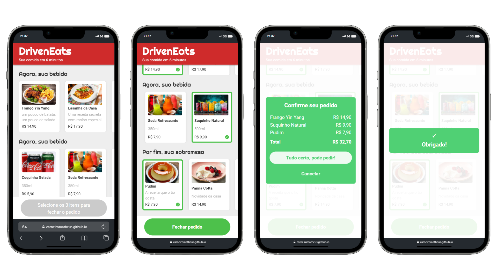

    

  

## Sobre a aplicação

Implementação do site (apenas a versão *mobile*) do DrivenEats, um restaurante especial que entrega seu pedido em 6 minutos!

Para isso, o restaurante só trabalha com um tipo específico de pedido: o combo de **Prato + Bebida + Sobremesa.**

O site permite de forma fácil a escolha do seu combo, enviando em seguida o pedido por WhatsApp diretamente para o restaurante.

 

 

[Acesse o DrivenEats](https://carneiromatheus.github.io/driveneats-food-app/) 

## Como utilizar

1. Selecione o seu prato;
2. Selecione a sua bebida;
3. Selecione a sua sobremesa;
4. Confirme o seu pedido.

